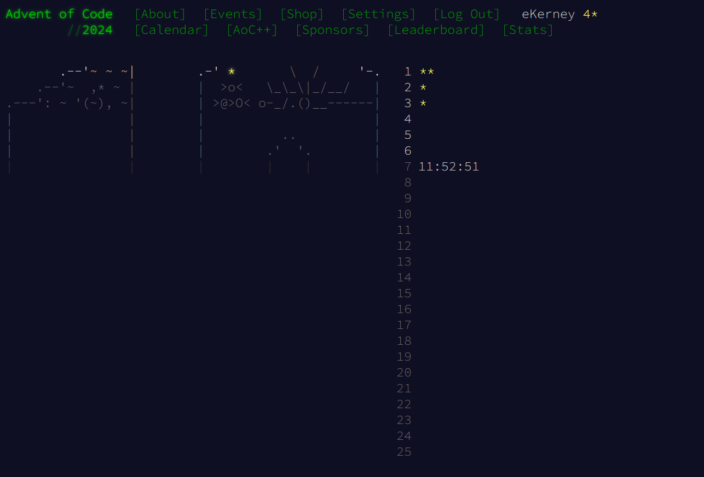

# aoc-2024-rust
<p align="left"> <a href="https://twitter.com/locationartist" target="blank"></a> </p>

### [Advent of Code 2024](https://adventofcode.com/)

From the website: 
> Advent of Code is an Advent calendar of small programming puzzles for a variety of skill levels that can be solved in any programming language you like. People use them as interview prep, company training, university coursework, practice problems, a speed contest, or to challenge each other.

#### 2024 AoC Specs
- 2024 Language: Rust 
- Stars as of 12-2-2024: 2 
- 2023 Language: Rust 

#### Rust Resources
- [rust lang org get started](https://www.rust-lang.org/learn/get-started)
- [half hour to learn rust](https://fasterthanli.me/articles/a-half-hour-to-learn-rust)
- [rust for the impatient](https://www.youtube.com/watch?v=br3GIIQeefY)
- [Georust.org](https://georust.org/)


#### Installing Rust on WSL2 
```bash

# installing rust 

https://www.rust-lang.org/tools/install 

curl --proto '=https' --tlsv1.2 -sSf https://sh.rustup.rs | sh

# default install 
# stable-x86_64-unknown-linux-gnu installed - rustc 1.83.0 (90b35a623 2024-11-26)

```
 

AoC2024 and website Courtesy of [Eric Wastl](https://was.tl/)


